# 摩托车维护记录 - 项目架构文档（更新版）

> **最后更新：** 2025-12-02 18:00:00
> **项目状态：** 业务应用（已从TDesign演示项目转型）
> **项目类型：** 微信小程序 - 摩托车维护记录管理系统
> **UI 框架：** TDesign MiniProgram

---

## 📋 项目概述

本项目是一个功能完整的**摩托车维护记录管理应用**，基于微信小程序和腾讯 TDesign MiniProgram 组件库构建。项目已经从最初的TDesign组件演示成功转型为实际的业务应用。

### 核心业务功能

- ✅ **车辆管理** - 车辆信息的添加、编辑、选择
- ✅ **保养记录** - 摩托车保养记录的增删改查
- ✅ **油耗记录** - 油耗数据的记录和分析
- ✅ **数据统计** - 提供保养和油耗的数据概览
- ✅ **导入导出** - 支持CSV格式的数据导入导出
- ✅ **个人中心** - 用户配置和数据管理

### 技术栈

- **小程序框架**：微信小程序原生框架
- **UI 组件库**：TDesign MiniProgram（通过 npm 包管理）
- **渲染引擎**：支持 Webview 和 Skyline 双渲染模式
- **开发语言**：JavaScript + TypeScript 类型定义
- **样式方案**：WXSS（微信小程序样式）
- **构建工具**：微信开发者工具
- **数据存储**：微信小程序本地存储 + CSV文件处理

---

## 🏗️ 项目架构 Mermaid 图

```mermaid
graph TB
    A[根目录] --> B[app.js/json/wxss/d.ts]
    A --> C[pages/ - 13个业务页面]
    A --> D[components/ - 10个自定义组件]
    A --> E[miniprogram_npm/ - TDesign组件库]
    A --> F[utils/ - 12个工具模块]
    A --> G[assets/ - 静态资源]
    A --> H[behaviors/ - Skyline支持]
    A --> I[backup/ - 清理备份]

    B --> B1[应用入口配置]
    C --> C1[首页仪表板]
    C --> C2[保养管理模块]
    C --> C3[油耗管理模块]
    C --> C4[车辆管理模块]
    C --> C5[个人中心模块]
    C --> C6[CSV导入预览]

    D --> D1[stat-card - 统计卡片]
    D --> D2[maintenance-item - 保养项目]
    D --> D3[fuel-item - 油耗项目]
    D --> D4[list-stats - 列表统计]
    D --> D5[action-selector - 操作选择器]
    D --> D6[green-radio-group - 绿色单选组]
    D --> D7[pull-down-list - 下拉列表]
    D --> D8[trd-privacy - 隐私协议]

    F --> F1[storage.js - 本地存储]
    F --> F2[csv-parser.js - CSV解析]
    F --> F3[csv-exporter.js - CSV导出]
    F --> F4[import-export.js - 导入导出逻辑]
    F --> F5[csv-validator.js - CSV验证]
    F --> F6[calculator.js - 计算工具]
    F --> F7[migrate-fuel-consumption.js - 油耗迁移]
    F --> F8[form-validator.js - 表单验证]
    F --> F9[mock-data.js - 模拟数据]
    F --> F10[gulpError.js - 错误处理]
    F --> F11[file.js - 文件操作]

    G --> G1[tabbar图标集]
    G --> G2[TDesign Logo]

    I --> I1[清理备份报告]
    I --> I2[未使用页面备份]

    style A fill:#e1f5fe
    style C fill:#fff3e0
    style D fill:#f3e5f5
    style F fill:#e8f5e9
```



---

## 📁 实际目录结构

```
MotorcycleMaintenanceRecord/
├── app.js                      # 应用入口逻辑（包含启动逻辑和数据迁移）
├── app.json                    # 精简配置（13个业务页面）
├── app.wxss                    # 全局样式
├── app.d.ts                    # TypeScript 类型定义
├── project.config.json         # 微信开发者工具配置
├── sitemap.json               # 小程序站点地图
├── theme.json                 # 主题配置
│
├── pages/                      # 业务页面目录（13个页面）
│   ├── index/                 # 🔹 首页仪表板
│   ├── maintenance-list/      # 🔹 保养记录列表
│   ├── fuel-list/             # 🔹 油耗记录列表
│   ├── fuel-overview/         # 🔹 油耗数据概览
│   ├── profile/               # 🔹 个人中心
│   ├── vehicle-select/        # 🔹 车辆选择
│   ├── vehicle-manage/        # 🔹 车辆管理
│   ├── vehicle-edit/          # 🔹 车辆编辑
│   ├── maintenance-detail/    # 🔹 保养详情
│   ├── fuel-detail/           # 🔹 油耗详情
│   ├── maintenance-add/       # 🔹 新增保养
│   ├── fuel-add/              # 🔹 新增油耗
│   └── csv-import-preview/    # 🔹 CSV导入预览
│
├── components/                 # 自定义组件（10个）
│   ├── demo-header/           # 页面头部组件（遗留）
│   ├── demo-block/            # 内容块组件（遗留）
│   ├── pull-down-list/        # 下拉列表组件
│   ├── trd-privacy/           # 隐私协议组件
│   ├── stat-card/             # ✅ 新增：统计卡片组件
│   ├── maintenance-item/      # ✅ 新增：保养项目组件
│   ├── fuel-item/             # ✅ 新增：油耗项目组件
│   ├── list-stats/            # ✅ 新增：列表统计组件
│   ├── action-selector/       # ✅ 新增：操作选择器组件
│   └── green-radio-group/     # ✅ 新增：绿色单选按钮组
│
├── miniprogram_npm/            # npm 构建产物
│   └── tdesign-miniprogram/    # TDesign 组件库（53个组件）
│       ├── button/            # 按钮组件
│       ├── cell/              # 单元格组件
│       ├── cell-group/        # 单元格组组件
│       ├── icon/              # 图标组件
│       └── [49个其他组件]     # 其他TDesign组件
│
├── utils/                      # 工具函数模块（12个）
│   ├── storage.js              # ✅ 本地存储管理
│   ├── csv-parser.js           # ✅ CSV解析器
│   ├── csv-exporter.js         # ✅ CSV导出器
│   ├── import-export.js        # ✅ 导入导出业务逻辑
│   ├── csv-validator.js        # ✅ CSV验证器
│   ├── calculator.js           # ✅ 计算工具
│   ├── migrate-fuel-consumption.js # ✅ 油耗数据迁移
│   ├── form-validator.js       # ✅ 表单验证
│   ├── mock-data.js            # ✅ 模拟数据
│   ├── gulpError.js            # Gulp错误处理
│   ├── file.js                 # 文件操作工具
│   └── [其他工具函数]
│
├── behaviors/                  # 小程序行为
│   └── skyline.js              # Skyline 渲染引擎行为
│
├── assets/                     # 静态资源
│   ├── tabbar/                 # ✅ 新增：自定义标签栏图标（8个）
│   │   ├── home.png
│   │   ├── home-active.png
│   │   ├── maintenance.png
│   │   ├── maintenance-active.png
│   │   ├── fuel.png
│   │   ├── fuel-active.png
│   │   ├── profile.png
│   │   └── profile-active.png
│   ├── TDesign-logo_light.png  # TDesign Logo（亮色）
│   └── TDesign-logo_dark.png   # TDesign Logo（深色）
│
├── backup/                     # 🔹 清理备份目录
│   ├── unused-pages/           # 备份的63个TDesign示例页面（6.1MB）
│   └── 清理报告.md             # 详细的清理报告文档
│
└── .claude/                    # AI 上下文文档目录
    ├── CLAUDE.md              # 本文档
    ├── operations-log.md      # 操作日志
    ├── context-summary-*.md   # 上下文摘要
    └── plan/                  # 计划文件
        ├── 页面清理计划.md
        └── 未使用页面清单.txt
```

---

## 📦 模块索引

### 1. **应用核心（根目录）**
- **入口文件**：`app.js`, `app.json`, `app.wxss`
- **关键配置**：
  - 支持深色模式（darkmode: true）
  - 自定义导航栏（navigationStyle: custom）
  - Skyline 渲染引擎支持
  - 懒加载优化（lazyCodeLoading: requiredComponents）
- **页面配置**：13个业务页面（详见下文）

### 2. **业务页面模块（pages/）** - **13个业务页面**

#### 🔹 首页模块
- `index/index` - 首页仪表板（车辆概览、最近记录）

#### 🔹 保养管理模块
- `maintenance-list/index` - 保养记录列表
- `maintenance-detail/index` - 保养详情查看
- `maintenance-add/index` - 新增保养记录

#### 🔹 油耗管理模块
- `fuel-list/index` - 油耗记录列表
- `fuel-overview/index` - 油耗数据概览分析
- `fuel-detail/index` - 油耗详情查看
- `fuel-add/index` - 新增油耗记录

#### 🔹 车辆管理模块
- `vehicle-select/index` - 车辆选择
- `vehicle-manage/index` - 车辆管理
- `vehicle-edit/index` - 车辆信息编辑

#### 🔹 个人中心模块
- `profile/index` - 个人中心和设置

#### 🔹 数据导入模块
- `csv-import-preview/index` - CSV导入预览

### 3. **自定义组件（components/）** - **10个组件**

#### ✅ 业务组件（6个新增）
- `stat-card/` - 统计卡片（用于首页数据展示）
- `maintenance-item/` - 保养项目列表项
- `fuel-item/` - 油耗项目列表项
- `list-stats/` - 列表统计数据展示
- `action-selector/` - 操作选择器
- `green-radio-group/` - 绿色主题单选按钮组

#### 🔹 基础组件（4个）
- `pull-down-list/` - 下拉列表
- `trd-privacy/` - 隐私协议
- `demo-header/` - 页面头部（可能不再使用）
- `demo-block/` - 内容块组件（可能不再使用）

### 4. **工具模块（utils/）** - **12个工具**

#### ✅ 核心业务工具（9个新增）
- `storage.js` - 本地存储封装（车辆、保养、油耗数据）
- `csv-parser.js` - CSV文件解析
- `csv-exporter.js` - CSV文件导出
- `import-export.js` - 导入导出业务逻辑
- `csv-validator.js` - CSV数据验证
- `calculator.js` - 计算工具（油耗计算等）
- `migrate-fuel-consumption.js` - 油耗数据迁移
- `form-validator.js` - 表单验证
- `mock-data.js` - 模拟数据生成

#### 🔹 基础工具（3个）
- `gulpError.js` - Gulp错误处理
- `file.js` - 文件操作工具

### 5. **TDesign 组件库（miniprogram_npm/）**
- **来源**：npm 包 `tdesign-miniprogram`
- **组件数量**：53个 UI 组件
- **使用方式**：按需在页面json中注册使用

### 6. **静态资源（assets/）**
- **tabbar图标**：8个自定义标签栏图标
- **Logo图片**：TDesign Logo（亮色/深色）

### 7. **备份目录（backup/）**
- **清理报告**：`清理报告.md`（详细记录清理过程）
- **页面备份**：`unused-pages/`（63个TDesign示例页面备份）

---

## 🔧 全局配置与规范

### 1. **项目配置（project.config.json）**
- **AppID**：`wxcc20aef2cedde57b`
- **项目名称**：TDesign
- **基础库版本**：3.6.3
- **关键设置**：
  - ES6 转 ES5：已启用
  - 增强编译：已禁用
  - Skyline 渲染：已启用
  - 大包体积支持：已启用
  - 代码压缩：已启用（WXSS + WXML）

### 2. **页面配置（app.json）**
```json
{
  "pages": [
    "pages/index/index",           # 首页
    "pages/maintenance-list/index", # 保养列表
    "pages/fuel-list/index",       # 油耗列表
    "pages/profile/index",         # 个人中心
    "pages/vehicle-select/index",  # 车辆选择
    "pages/vehicle-manage/index",  # 车辆管理
    "pages/vehicle-edit/index",    # 车辆编辑
    "pages/maintenance-detail/index", # 保养详情
    "pages/fuel-detail/index",     # 油耗详情
    "pages/fuel-overview/index",   # 油耗概览
    "pages/maintenance-add/index", # 新增保养
    "pages/fuel-add/index",        # 新增油耗
    "pages/csv-import-preview/index" # CSV导入预览
  ]
}
```

### 3. **编码规范**
- **缩进**：2 空格
- **命名约定**：
  - 文件名：kebab-case（如 `maintenance-item`）
  - 组件名：PascalCase（如 `MaintenanceItem`）
  - 页面路径：与文件名一致
- **代码风格**：
  - 使用 ES6+ 语法
  - 页面使用 `Page()` 构造器
  - 组件使用 `Component()` 构造器
  - 优先使用 TDesign 组件

---

## 🔍 关键业务功能

### 1. **车辆管理**
- 支持多车辆管理
- 车辆信息的增删改查
- 车辆选择器组件

### 2. **保养记录**
- 保养项目的完整CRUD
- 保养提醒功能
- 保养统计和分析

### 3. **油耗记录**
- 油耗数据的记录和计算
- 油耗趋势分析
- 油耗数据迁移工具

### 4. **数据导入导出**
- CSV格式数据导入
- CSV格式数据导出
- 数据验证和预览

### 5. **统计和分析**
- 首页数据仪表板
- 列表统计数据展示
- 油耗概览分析

---

## 📊 项目统计

| 指标 | 数量 | 说明 |
|------|------|------|
| **业务页面** | 13个 | 核心业务功能页面 |
| **自定义组件** | 10个 | 6个业务组件 + 4个基础组件 |
| **工具模块** | 12个 | 9个业务工具 + 3个基础工具 |
| **TDesign组件** | 53个 | 通过npm管理的UI组件库 |
| **静态资源** | 10个文件 | 图标和Logo |
| **备份页面** | 63个 | 已清理的TDesign示例页面 |
| **代码行数估算** | ~8,000+ 行 | 业务代码为主 |

---

## 🔄 版本历史

### 重大变更（2025-12-02）
- **转型完成**：从TDesign演示项目成功转型为业务应用
- **页面清理**：删除63个TDesign示例页面，保留13个业务页面
- **功能增强**：新增6个业务组件和9个业务工具模块
- **文档更新**：CLAUDE.md全面更新以反映实际项目状态

### 当前版本
- **基础库要求**：3.6.3+
- **Skyline 支持**：3.4.3 - 15.255.255
- **项目类型**：摩托车维护记录管理系统

---

## 📝 开发注意事项

### 1. **开发前必读**
- ✅ 熟悉业务需求（车辆、保养、油耗管理）
- ✅ 理解数据流（本地存储 + CSV导入导出）
- ✅ 查看工具模块文档（utils/目录下的注释）
- ✅ 遵循项目既有命名规范和目录结构

### 2. **添加新功能**
1. 在对应模块目录下创建文件
2. 遵循现有的代码风格和模式
3. 更新相关文档
4. 添加必要的测试

### 3. **数据管理**
- 使用 `storage.js` 进行本地存储操作
- 遵循现有的数据格式和结构
- 新增数据字段时注意向后兼容

### 4. **性能优化**
- ✅ 已启用懒加载
- ✅ 包体积已优化（删除无用页面）
- 🔧 建议：定期分析包体积，优化资源加载

---

## 🚀 构建与部署

### 开发环境
```bash
# 使用微信开发者工具打开项目目录
# 工具会自动识别 project.config.json
```

### 预览与发布
1. **开发预览**：微信开发者工具 → 预览 → 扫码体验
2. **上传代码**：微信开发者工具 → 上传 → 填写版本号和描述
3. **提交审核**：微信公众平台 → 版本管理 → 提交审核
4. **发布上线**：审核通过后 → 发布

---

## 📚 相关资源

### 官方文档
- [微信小程序官方文档](https://developers.weixin.qq.com/miniprogram/dev/framework/)
- [TDesign MiniProgram 组件库](https://tdesign.tencent.com/miniprogram/overview)

### 项目文档
- [清理报告](backup/清理报告.md) - 详细的页面清理记录
- [工具模块文档](utils/) - 各工具函数的详细说明

---

> **文档维护**：本文档由 Claude Code AI 基于项目实际代码结构分析生成。
> **最后更新**：2025-12-02
> **项目状态**：业务应用（摩托车维护记录管理系统）

---

## ⚠️ 重要说明

**本项目已完成从TDesign演示项目到业务应用的转型：**
- ✅ 删除了所有非业务相关的TDesign示例页面
- ✅ 保留了TDesign UI组件库用于界面构建
- ✅ 新增了完整的摩托车维护记录业务功能
- ✅ 优化了项目结构和包体积
- ✅ 更新了文档以反映实际项目状态

如需查看之前的TDesign示例页面，请参考：`backup/unused-pages/` 目录和 `backup/清理报告.md`。