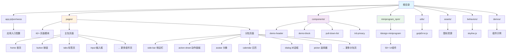

# 摩托车维护记录 - 项目架构文档

> 生成时间：2025-12-01 18:00:48
> 项目类型：微信小程序
> UI 框架：TDesign MiniProgram

---

## 📋 项目概述

本项目是一个基于**微信小程序**的摩托车维护记录应用，使用腾讯 **TDesign MiniProgram** 组件库构建。项目展示了 TDesign 组件库的各种 UI 组件及其用法示例。

### 核心特性

- ✅ 完整的 TDesign UI 组件库集成
- ✅ 支持 Skyline 渲染引擎
- ✅ 支持深色模式（darkmode）
- ✅ 分包加载优化
- ✅ 懒加载支持
- ✅ TypeScript 类型定义支持

### 技术栈

- **小程序框架**：微信小程序原生框架
- **UI 组件库**：TDesign MiniProgram（通过 npm 包管理）
- **渲染引擎**：支持 Webview 和 Skyline 双渲染模式
- **开发语言**：JavaScript + TypeScript 类型定义
- **样式方案**：WXSS（微信小程序样式）
- **构建工具**：微信开发者工具

---

## 🏗️ 项目架构 Mermaid 图



---

## 📁 目录结构详解

```
MotorcycleMaintenanceRecord/
├── app.js                      # 小程序入口逻辑
├── app.json                    # 小程序全局配置（页面路由、分包、组件等）
├── app.wxss                    # 全局样式
├── app.d.ts                    # TypeScript 类型定义
│
├── pages/                      # 页面目录（62+ 页面）
│   ├── home/                   # 首页（组件列表）
│   ├── button/                 # 按钮组件示例
│   ├── tabs/                   # 标签页组件示例
│   ├── input/                  # 输入框组件示例
│   ├── [...]                   # 其他 50+ 组件示例页面
│   └── [subpackages]/          # 分包页面（side-bar、action-sheet等）
│
├── components/                 # 自定义组件
│   ├── demo-header/            # Demo 页面头部组件
│   ├── demo-block/             # Demo 页面块组件
│   ├── pull-down-list/         # 下拉列表组件
│   └── trd-privacy/            # 隐私协议组件
│
├── miniprogram_npm/            # npm 构建产物
│   └── tdesign-miniprogram/    # TDesign 组件库
│       ├── button/
│       ├── tabs/
│       ├── input/
│       └── [50+ 组件]
│
├── demos/                      # 组件 Demo 示例
│   └── radio/                  # Radio 组件示例
│
├── behaviors/                  # 小程序行为
│   └── skyline.js              # Skyline 渲染引擎行为
│
├── utils/                      # 工具函数
│   └── gulpError.js            # Gulp 错误处理工具
│
├── assets/                     # 静态资源
│   ├── TDesign-logo_light.png  # 亮色主题 Logo
│   └── TDesign-logo_dark.png   # 深色主题 Logo
│
├── project.config.json         # 微信开发者工具配置
├── project.private.config.json # 私有配置
├── sitemap.json               # 小程序站点地图
├── theme.json                 # 主题配置
│
└── .claude/                   # AI 上下文文档目录
    ├── CLAUDE.md              # 本文档
    ├── operations-log.md      # 操作日志
    └── context-summary-*.md   # 上下文摘要
```

---

## 📦 模块索引

本项目包含以下主要模块：

### 1. **应用核心（根目录）**
- **入口文件**：`app.js`, `app.json`, `app.wxss`
- **关键配置**：
  - 支持深色模式（darkmode: true）
  - 自定义导航栏（navigationStyle: custom）
  - Skyline 渲染引擎支持
  - 懒加载优化（lazyCodeLoading: requiredComponents）
- **详细文档**：无（根目录配置文件自解释）

### 2. **页面模块（pages/）**
- **页面数量**：62+ 个页面
- **主要页面**：
  - `home/home` - 首页（组件列表）
  - `button/` - 按钮组件示例
  - `tabs/` - 标签页组件示例
  - `input/` - 输入框组件示例
  - [更多组件页面...]
- **分包页面**：
  - `side-bar/` - 侧边栏
  - `action-sheet/` - 动作面板
  - `avatar/` - 头像
  - `calendar/` - 日历
  - `dialog/` - 对话框
  - `picker/` - 选择器
  - `rate/` - 评分
  - `swiper/` - 轮播
  - `swipe-cell/` - 滑动单元格
  - `tree-select/` - 树形选择
  - `indexes/` - 索引列表
- **详细文档**：[pages/CLAUDE.md](pages/CLAUDE.md)

### 3. **自定义组件（components/）**
- **组件列表**：
  - `demo-header/` - Demo 页面头部
  - `demo-block/` - Demo 页面块
  - `pull-down-list/` - 下拉列表
  - `trd-privacy/` - 隐私协议
- **详细文档**：[components/CLAUDE.md](components/CLAUDE.md)

### 4. **TDesign 组件库（miniprogram_npm/tdesign-miniprogram/）**
- **来源**：npm 包 `tdesign-miniprogram`
- **组件数量**：50+ 个 UI 组件
- **主要组件**：
  - 基础：Button, Icon, Cell, Image, Layout
  - 表单：Input, Textarea, Radio, Checkbox, Switch, Slider, Stepper, Upload, Picker, DateTimePicker, Cascader, ColorPicker
  - 导航：Tabs, TabBar, Navbar, SideBar, Steps, Indexes
  - 反馈：Toast, Message, Dialog, ActionSheet, Drawer, Popup, Overlay, Loading, Progress, Skeleton
  - 展示：Badge, Tag, Avatar, Divider, Empty, Footer, Grid, Swiper, ImageViewer, CountDown, Rate, Guide
  - 其他：BackTop, NoticeBar, PullDownRefresh, Search, Sticky, Transition, TreeSelect
- **详细文档**：查阅 [TDesign MiniProgram 官方文档](https://tdesign.tencent.com/miniprogram/overview)

### 5. **工具模块（utils/）**
- **文件**：`gulpError.js`
- **功能**：Gulp 构建错误检测与跳转

### 6. **行为模块（behaviors/）**
- **文件**：`skyline.js`
- **功能**：Skyline 渲染引擎行为定义

### 7. **Demo 示例（demos/）**
- **示例**：`radio/` - Radio 组件各种用法示例

### 8. **静态资源（assets/）**
- **文件**：Logo 图片（亮色/深色主题）

---

## 🔧 全局配置与规范

### 1. **项目配置（project.config.json）**
- **AppID**：`wxcc20aef2cedde57b`
- **项目名称**：TDesign
- **基础库版本**：3.6.3
- **关键设置**：
  - ES6 转 ES5：已启用
  - 增强编译：已禁用
  - Skyline 渲染：已启用
  - 大包体积支持：已启用
  - 代码压缩：已启用（WXSS + WXML）

### 2. **编码规范**
- **缩进**：2 空格（自动）
- **命名约定**：
  - 文件名：kebab-case（如 `pull-down-list`）
  - 组件名：PascalCase（如 `DemoHeader`）
  - 页面路径：与文件名一致
- **代码风格**：
  - 使用 ES6+ 语法
  - 页面使用 `Page()` 构造器
  - 组件使用 `Component()` 构造器
  - 优先使用 TDesign 组件，避免重复造轮子

### 3. **渲染模式**
本项目支持两种渲染模式：
- **Webview 模式**（默认）：传统小程序渲染
- **Skyline 模式**：新一代高性能渲染引擎
  - 通过 URL 参数 `?skyline=1` 切换
  - 相关页面位于 `pages/*/skyline/` 子目录

### 4. **分包策略**
- **主包**：核心页面（home、button、tabs、input 等）
- **分包**：
  - `pages/side-bar/` - 侧边栏相关
  - `pages/action-sheet/` - 动作面板
  - `pages/avatar/` - 头像
  - `pages/calendar/` - 日历
  - `pages/dialog/` - 对话框
  - `pages/picker/` - 选择器
  - `pages/rate/` - 评分
  - `pages/swiper/` - 轮播
  - `pages/swipe-cell/` - 滑动单元格
  - `pages/tree-select/` - 树形选择
  - `pages/indexes/` - 索引列表

### 5. **全局组件注册（app.json）**
```json
{
  "usingComponents": {
    "t-demo": "./components/demo-block/index",
    "t-demo-header": "./components/demo-header/index",
    "t-button": "tdesign-miniprogram/button/button",
    "t-icon": "tdesign-miniprogram/icon/icon",
    "t-navbar": "tdesign-miniprogram/navbar/navbar"
  }
}
```

---

## 🔍 关键入口与流程

### 应用启动流程
1. **入口**：`app.js` - `onShow()` 钩子
2. **错误检测**：检查 `gulpError` 是否为占位符
3. **路由跳转**：
   - 如果有 Gulp 错误 → 跳转到 `/pages/gulp-error/index`
   - 否则 → 正常启动，显示首页

### 首页导航流程
1. **入口**：`pages/home/home`
2. **加载逻辑**：
   - 检测是否为 Skyline 模式（`options.skyline`）
   - 加载对应的组件列表（`list` 或 `skylineList`）
3. **点击组件**：
   - 解析组件名称 → 转换为 kebab-case
   - 构造页面路径 → 跳转到对应组件示例页
   - 失败处理 → 跳转到导航失败页

---

## 📊 数据与依赖关系

### 核心依赖
- **TDesign MiniProgram**：`miniprogram_npm/tdesign-miniprogram/`
  - 版本：通过 npm 管理（需查看 package.json）
  - 文档：https://tdesign.tencent.com/miniprogram/overview

### 外部资源
- 无外部 API 依赖（纯前端展示项目）

### 数据流向
```
app.js (入口)
  ↓
pages/home/home (首页)
  ↓ (点击组件)
pages/[component]/[component] (组件示例页)
  ↓ (使用组件)
miniprogram_npm/tdesign-miniprogram/[component] (TDesign 组件)
```

---

## 🧪 测试与验证

### 测试策略
- **目前状态**：无自动化测试
- **建议**：
  - 为关键页面添加单元测试
  - 为自定义组件添加组件测试
  - 使用微信小程序官方测试工具

### 验证方式
- **开发阶段**：微信开发者工具预览
- **真机测试**：扫码体验
- **性能分析**：使用微信开发者工具的性能面板

---

## 📝 开发注意事项

### 1. **开发前必读**
- ✅ 熟悉 TDesign MiniProgram 组件库文档
- ✅ 理解微信小程序生命周期
- ✅ 了解 Skyline 渲染引擎特性与限制
- ✅ 遵循项目既有命名规范和目录结构

### 2. **添加新页面**
1. 在 `pages/` 下创建新目录（如 `new-page/`）
2. 创建页面文件：`new-page.js`, `new-page.json`, `new-page.wxml`, `new-page.wxss`
3. 在 `app.json` 的 `pages` 数组中添加路径 `"pages/new-page/new-page"`
4. 如果需要分包，添加到 `subpackages` 数组

### 3. **使用 TDesign 组件**
```javascript
// 方式1：全局注册（app.json）
"usingComponents": {
  "t-button": "tdesign-miniprogram/button/button"
}

// 方式2：页面注册（page.json）
{
  "usingComponents": {
    "t-input": "tdesign-miniprogram/input/input"
  }
}
```

### 4. **Skyline 模式开发**
- 在对应页面创建 `skyline/` 子目录
- 复制页面文件到 `skyline/` 目录
- 根据 Skyline 特性调整代码（参考 TDesign 文档）

### 5. **样式开发**
- 优先使用 TDesign 提供的主题变量
- 全局样式写在 `app.wxss`
- 页面样式写在对应 `.wxss` 文件
- 支持深色模式，使用 `@navTxtStyle` 等主题变量

### 6. **性能优化**
- ✅ 已启用分包加载
- ✅ 已启用懒加载（requiredComponents）
- ✅ 已启用代码压缩
- 🔧 建议：进一步分析包体积，优化资源加载

---

## 🚀 构建与部署

### 开发环境
```bash
# 使用微信开发者工具打开项目目录
# 工具会自动识别 project.config.json
```

### 预览与发布
1. **开发预览**：微信开发者工具 → 预览 → 扫码体验
2. **上传代码**：微信开发者工具 → 上传 → 填写版本号和描述
3. **提交审核**：微信公众平台 → 版本管理 → 提交审核
4. **发布上线**：审核通过后 → 发布

---

## 📚 相关资源

### 官方文档
- [微信小程序官方文档](https://developers.weixin.qq.com/miniprogram/dev/framework/)
- [TDesign MiniProgram 组件库](https://tdesign.tencent.com/miniprogram/overview)
- [Skyline 渲染引擎文档](https://developers.weixin.qq.com/miniprogram/dev/framework/runtime/skyline/introduction.html)

### 相关项目
- [TDesign MiniProgram GitHub](https://github.com/Tencent/tdesign-miniprogram)

---

## 📈 项目统计

- **总页面数**：62+
- **自定义组件数**：4
- **TDesign 组件数**：50+
- **分包数量**：11
- **目录结构层级**：3-4 层
- **代码行数**：约 10,000+ 行（估算）

---

## 🔄 版本历史

- **当前版本**：基于 TDesign MiniProgram 最新版
- **基础库要求**：3.6.3+
- **Skyline 支持版本**：3.4.3 - 15.255.255

---

## 📞 联系与支持

如需帮助或有问题，请参考：
- TDesign 官方文档
- 微信小程序社区
- 项目 Issue 跟踪器（如有）

---

> **文档维护**：本文档由 Claude Code AI 自动生成，基于项目实际代码结构分析。
> **更新建议**：当项目结构发生重大变化时，重新运行 `/zcf:init-project` 命令更新文档。
